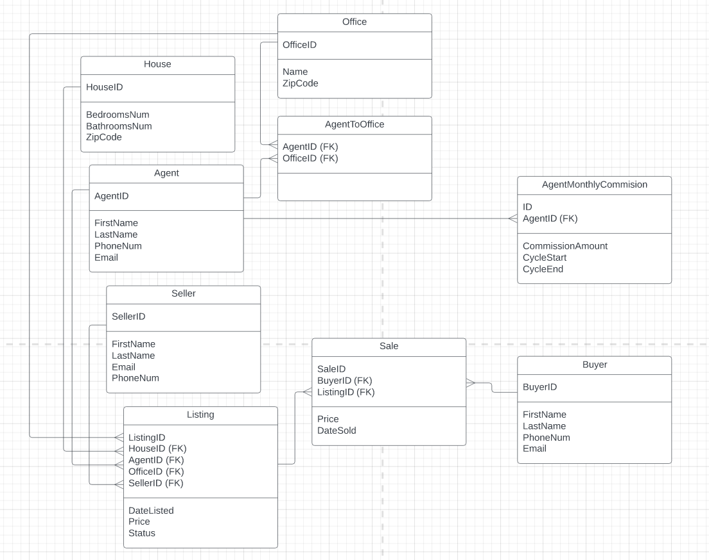

# About this repo: Real Estate Head Office Database

This is a database for a hypothetical Real Estate Head Office. It was created for an assignments for my CS162: SOftware engineering course. The original assignment description can be found here: https://github.com/minerva-university/cs162/blob/main/assignments/4_database.md

## Description

You have been tasked with building a database system for a large franchised real
estate company. This means that the company has many offices located all over
the country. Each office is responsible for selling houses in a particular area.
However an estate agent can be associated with one or more offices.

### Inserting data
1. Whenever a house is listed then the following things need to happen:
 -  All the relevant details of that house need to be captured, ie. at least: seller details, # of bedrooms, # of bathrooms, listing price, zip code, date of listing, the listing estate agent, and the appropriate office.
2. Whenever a house is sold then the following things need to happen:
 - The estate agent commission needs to be calculated. This happens on a sliding scale:
   - For houses sold below $100,000 the commission is 10%
   - For houses between $100,000 and $200,000 the commission is 7.5%
   - For houses between $200,000 and $500,000 the commission is 6%
   - For houses between $500,000 and $1,000,000 the commission is 5%
   - For houses above $1,000,000 the commission is 4%
 - All appropriate details related to the sale must be captured, ie. at least: buyer details, sale price, date of sale, the selling estate agent.
 - The original listing must be marked as sold.

### Querying data
Every month the following reports need to be run:
 - Find the top 5 offices with the most sales for that month.
 - Find the top 5 estate agents who have sold the most for the month (include their contact details and their sales details so that it is easy contact them and congratulate them).
 - Calculate the commission that each estate agent must receive and store the results in a separate table. 
 - For all houses that were sold that month, calculate the average number of days on the market.
 - For all houses that were sold that month, calculate the average selling price

### Testing:
To test your solution you will need to create fictitious data and ensure that the correct results are calculated from your SQL code.

# Running the app

## MacOS

Use the following commands to initialize the databse and run the app. You can copy-paste all commands at once in the terminal:

```bash
python3 -m venv venv
source venv/bin/activate
pip3 install -r requirements.txt
python3 app.py
```
Then open another terminal to load the randomly generated data.
```bash
python3 insert_data.py
```

Reload the app in the browser to load the data. 

# Running the tests

## MacOS

Use the following commands to initialize the databse and run the app. You can copy-paste all commands at once in the terminal:

```bash
python3 -m venv venv
source venv/bin/activate
pip3 install -r requirements.txt
python3 test.py
```

If you want to generate the coverage report then use the following commands.
First install coverage:
```bash
pip install coverage
```
Then run the tests:
```bash
python -m coverage run -m unittest test.py
```

Finally get the report:
```bash
python -m coverage report -m
```

# UML Diagram of the Database Schema


# LO tags + Data normalization, indices, and transactions
## \#sql

For this assignment I implemented the database in SQLAclhemy because I wanted to get experience with something new since I already used SQLite for our final project. 

When designing the database I applied the ACID principles and data normalization which all tables follow. The UML diagram of the schema can be seen above. 

**Data normalization:**

Here I reference tables though in SQLAclhemy we should thin more in terms of classes (tables), objects (rows), and instance attributes (column names).
- 1 Normal form:
All table columns take on a  single value (e.g. first name, email, zipcode, bedroom number).

Each column has a unique name - no columns repeat in a table. 
- 2 Normal Form
The table is in first normal form.

All columns are dependent on the primary key: each table serves a single purpose. This step was a bit hard but I believe I divided all tables accordingly. For example, there is a separate table for Sellers and all columns depend on the seller id. On the other hand for Sales there is a column for the seller id (to create a relationship between them) but no unneccessary information is included. There are no columns for seller name, phone, etc. but that information can still be accesses using the linked seller id. An analogous logic can be seen behind the creation of the Agent and AgentMonthlyCommission tables.

- 3 Normal Form
The table is in second normal form.
No transitive dependencies - each column is important and no value can be derived from another column. The only point of confusion at first glance might come from the Listing table where I ahve included both the agent id and the office id. One might think, well can't we get the office from the agent - the answer is no. First an agent might be linked to multiple offices. Second, what if the listing comes from an office the Agent was not linked to before? In that case I add the listing as well as new assocciation between the office and agent. 

**Transactions:**

When implementing the queries I was thinking about the ACID principles.

**Atomicity**
If anything goes wrong, I use `try` statemented where the `exception` executes a rollback in case something went wrong while the transaction was being executed. 

**Isolation**

From the documentation here it looks like the db.session automatically begins the transactions and session.begin() for a transaction is outdated https://docs.sqlalchemy.org/en/20/orm/session_transaction.html and this stack overflow explanation https://stackoverflow.com/questions/19904176/transactions-and-sqlalchemy
So I assumed that to be the case when writing the queries.

**Consistency**
To keep things consistent I always make sure to commit once all relevant actions in a transaction have been added to the session. For example, when creating sales I only commit after all sale instances were added and all relevant listing instances were updated to a status of "SOLD". 

**Durability**
This can still be improved especially if I also implement the WAL logging we discussed. 

**Indices:**

I include a single index in the queries file. It is created according to the rules discussed here https://stackoverflow.com/questions/107132/what-columns-generally-make-good-indexes

The index is based on the columns that are either in WHERE or JOIN clauses (and are not primary keys):

```python
Index('idx_sales_date', Sale.sale_date, Sale.price) 
```
`Sale.sale_date` is often used to filter the date so an index will speed it up.

`Sale.listing_id` is often used and is already a primary key so it is not included in the index.
`Sale.price` is not crucial but it is often used to order by it so it will make the query more efficient according to this resouruce: https://stackoverflow.com/questions/16792391/do-i-need-to-add-an-index-on-order-by-field#:~:text=Yes%2C%20index%20will%20help%20you,show%20the%20difference%20in%20execution.


Possible improvement for the database: right now I convert the the sale price to float before passing it because otherwise I get a warning. 
This is because SQLAclhemy/SQLite doesn't support Decimal data types which can lead to rounding errors. A solution online was to store
price (money) as integers or better as strings. 
I found out about this too late and I remember in class we discussed that we can also use Numeric type and be careful about rounding and digit so I kept it that way.

## \#communication
All code is easy to read and well documented with comments, descriptive function and variable names, doc strings, a thoroguh README file, and UML diagram.

## \#testing
I included Flask unit tests that import a test database and run several tests on all the queries. It covers quite a bit of the code but not all of it since I focused on testing the queries rather than the routing and other flask related functionalities. 

```bash
Name                          Stmts   Miss  Cover   Missing
-----------------------------------------------------------
db_data/generate_data.py        108     49    55%   37-58, 126-157, 162-189
flaskr_app/__init__.py            8      0   100%
flaskr_app/models/models.py      95      1    99%   144
flaskr_app/queries.py           118     22    81%   42-44, 72-74, 104-106, 135-137, 214-216, 232-239
flaskr_app/routes.py             54     37    31%   10, 15-25, 31-58, 64-72, 78-86, 93-101
test.py                          57      1    98%   116
test_data.py                     76      3    96%   68-70
-----------------------------------------------------------
TOTAL                           516    113    78%
```

## \#webstandards
I got the database to run as a flask app with randomly generated data. The HTML has a few errors that I was not able to fix even after using a validator. Specifically it looks like it shows any `{{url_for}}` or similar as an error because of the curly brackets.

## \#separationofconcerns
I followed best practices in terms of structuring the code. The structure of the routes is also easy to follow. 

# Code Listing (without HTML and CSS code)

app.py
```python
from flaskr_app import app, db
from db_data.populate_db import add_admin

if __name__ == "__main__":
    with app.app_context():
        db.drop_all()
        db.create_all()
        add_admin()

    app.run(debug=True)

```
insert_data.py
```python
from flaskr_app.models.models import AgentMonthlyCommission, Agent, agent_to_office, Buyer, House, Seller, Listing, Sale, Office
from db_data.generate_data import generate_agent, generate_office, generate_seller, generate_house, generate_buyer, generate_listing, generate_sale
from flaskr_app import app, db


# From the documentation here it looks like the db.session automatically begins the transactions and session.begin() is outdated
# https://docs.sqlalchemy.org/en/20/orm/session_transaction.html
# https://stackoverflow.com/questions/19904176/transactions-and-sqlalchemy
# So I assumed that to be the case when writing the queries.

# Insert data for offices, agents, listings and buyers.
agents = generate_agent(25)
with app.app_context():
    db.session.add_all(agents)
    db.session.commit()

offices = generate_office(6)
sellers = generate_seller(50)
houses = generate_house(50)
buyers = generate_buyer(50)
with app.app_context():
    db.session.add_all(offices)
    db.session.add_all(sellers)
    db.session.add_all(houses)
    db.session.add_all(buyers)
    db.session.commit()

listings = generate_listing()
with app.app_context():
    # Add listings. 
    db.session.add_all(listings)
    # If the agent isn't associated with the office of the listing, add that the agent worked for the office since they're both on the listing. 
    for listing in listings:
        related_agent = Agent.query.get(listing.agent_id)
        related_office = Office.query.get(listing.office_id)
        if related_office not in related_agent.offices:
            related_agent.offices.append(related_office)
            db.session.add(related_office)
    # Commit only after all relevant changes were made. 
    db.session.commit()

    print("\n PRINTING DATABASE TABLES -- to see that the items loaded successfully in the DB\n")
    print("\n 👱‍♂️ Agents 👱‍♂️\n ")

    print(db.session.query(Agent).all())
    print("\n 🏢 Offices 🏢\n ")
    print(db.session.query(Office).all())
    print("\n 🗒 Association table Agent-Office 🗒\n ")
    print(db.session.query(agent_to_office).all())
    print("\n 🧍‍♂️ Sellers 🧍‍♂️\n ")
    print(db.session.query(Seller).all())
    print("\n 🏡 Houses 🏡\n")
    print(db.session.query(House).all())
    print("\n 💵 Buyers 💵 \n ")
    print(db.session.query(Buyer).all())


    print("\n ⭐️ Listings ⭐️ \n")
    print(db.session.query(Listing).all())

sales = generate_sale()

with app.app_context():
    db.session.add_all(sales)
    for sale in sales:
        related_listing = Listing.query.get(sale.listing_id)
        related_listing.status = "SOLD"
        db.session.add(related_listing)
    db.session.commit()

    print("\n Listings after the sale 🌈 \n ")
    query = db.session.query(Listing).all()
    for s in query:
        print(s)
    print("\n 🚀 Sales 🚀\n ")
    query = db.session.query(Sale).all()
    for s in query:
        print(s)
```

test.py
```python
import unittest
from flask_testing import TestCase
from flask import Flask
from flaskr_app import db, queries
from test_data import test_data


class AppTest(TestCase):

    def create_app(self):
        """
        Initialize flask app for testing.
        """
        self.app = Flask(__name__)
        self.app.config['SQLALCHEMY_DATABASE_URI'] = 'sqlite://'
        self.app.config['SQLALCHEMY_TRACK_MODIFICATIONS'] = False
        self.app.config['TESTING'] = True

        return self.app

    def setUp(self):
        """
        Create test data to run the tests on. 
        """
        db.init_app(self.app)
        with self.app.app_context():
            db.create_all()
            # Generate the test data.
            test_data(db) 


    def test_monthly_sales_average_price1(self):
        """Tests the get_monthly_sales_average_price query function when there are sales in the month."""

        result = queries.get_monthly_sales_average_price(db = db, month = 12, year = 2022)

        self.assertEqual(10000, result)

    def test_monthly_sales_average_price2(self):
        """Tests the get_monthly_sales_average_price query function when there are NO sales in the month."""

        result = queries.get_monthly_sales_average_price(db = db, month = 11, year = 2022)

        self.assertEqual(0, result)

    def test_sale_duration1(self):
        """Tests the get_market_days query function when there are sales in the month."""

        result = queries.get_market_days(db = db, month = 12, year = 2022)

        # all listings were created on 2022/12/1  and all were sold on 2022/12/3 which is 2 days
        self.assertEqual(2, result)

    def test_sale_duration2(self):
        """Tests the get_market_days query function when there are NO sales in the month."""

        result = queries.get_market_days(db = db, month = 11, year = 2022)

        self.assertEqual(0, result)

    def test_top_agents1(self):
        """Tests the get_top_agents query function when there are NO sales in the month."""

        #fetch sql query result
        result = queries.get_top_agents(db = db, month = 11, year = 2022)
        
        # No sales that month so 0 top agents. 
        self.assertEqual(0, len(result))

    def test_top_agent2(self):
        """Tests the get_top_agents query function when there are sales in the month."""

        #fetch sql query result
        result = queries.get_top_agents(db = db, month = 12, year = 2022)
        
        # Only 1 agent with sales that month.
        self.assertEqual(1, len(result))
        # Check he has the correct total commission - 3 sales with sale price of 10000 each.
        self.assertEqual(10000*3, float(result[0][4]))

    def test_top_offices(self):
        """Tests the get_top_offices query function """
        #fetch sql query result
        result = queries.get_top_offices(db = db, month = 12, year = 2022)

        # 3 sales with 3 different offices that month so it should be 3 offices in top 5
        self.assertEqual(3, len(result))
        # Check that offices have correct revenue.
        self.assertEqual(10000, float(result[0][3]))
        self.assertEqual(10000, float(result[1][3]))
        self.assertEqual(10000, float(result[2][3]))

    def test_agent_commission1(self):
        """Tests the agent commission table and query function """
        result = queries.generate_monthly_commissions(db = db, month = 12, year = 2022)
        # Check that commissions loaded for all 5 agents
        self.assertEqual(5, len(result))
        # First agent sold 3 sales of 10_0000 each - check correct commission.
        self.assertEqual(10000*0.1*3, float(result[0][3]))
        # The second row should have 0 commission (no sales)
        self.assertEqual(0, result[1][3])

    def test_agent_commission2(self):
        """Tests the agent commission table and query function """
        result = queries.generate_monthly_commissions(db = db, month = 11, year = 2022)
        # Check that commissions loaded for all 5 agents
        self.assertEqual(5, len(result))
        # No agent sold anything
        self.assertEqual(0, float(result[0][3]))
        self.assertEqual(0, float(result[1][3]))
        self.assertEqual(0, float(result[2][3]))
        self.assertEqual(0, result[1][3])
        self.assertEqual(0, float(result[4][3]))

if __name__ == '__main__':
    unittest.main()
```

test_data.py
```python
from flaskr_app.models.models import AgentMonthlyCommission, Agent, Buyer, House, Seller, Listing, Sale, Office
from db_data.generate_data import generate_agent, generate_seller, generate_house, generate_buyer
import uuid
import datetime
import random
import string


def test_data(db):

    agents = generate_agent(5)
    db.session.add_all(agents)
    db.session.commit()

    offices = generate_office(5, agents=agents)
    sellers = generate_seller(5)
    houses = generate_house(5)


    listing_ids = []
    listings = []
    for i in range(5):
        listing_id =  str(uuid.uuid4())
        listing_ids.append(listing_id)

        listing = Listing(listing_id = listing_id, agent_id = agents[0].agent_id, house_id = houses[i].house_id, office_id = offices[i].office_id, 
                seller_id = sellers[i].seller_id, price = 1000, list_date = datetime.date(2022, 12, 1), status = "LISTED")

        listings.append(listing)

    buyers = generate_buyer(5)

    db.session.add_all(offices)
    db.session.add_all(agents)
    db.session.add_all(sellers)
    db.session.add_all(houses)
    db.session.add_all(buyers)
    db.session.add_all(listings)
    db.session.commit()

    print("PRINTING DATABASE TABLES")
    print("👱‍♂️ Agents 👱‍♂️")
    print(db.session.query(Agent).all())
    print("🏢 Offices 🏢")
    print(db.session.query(Office).all())
    print("🗒 Association table 🗒")
    print("🧍‍♂️ Sellers 🧍‍♂️")
    print(db.session.query(Seller).all())
    print("🏡 Houses 🏡")
    print(db.session.query(House).all())
    print("💵 Buyers 💵")
    print(db.session.query(Buyer).all())


    print("👱‍♂️ Sellers associated with listings table before any sales:")
    print(db.session.query(Seller).all())

    def add_sale(session, buyer_id, listing_id, price, sale_date):
        try:
            # Add sale. 
            sale = Sale(sale_id = str(uuid.uuid4()), buyer_id=buyer_id, listing_id=listing_id, price=price, sale_date = sale_date)
            session.add(sale)
            # Update listing status to sold. 
            sale_listing = session.query(Listing).get(listing_id)
            sale_listing.status = "SOLD"
            buyer = session.query(Buyer).get(buyer_id)
            session.commit()
        except:
            session.rollback()
            raise
        finally:
            print("✅ Completed a sale with listing id = {}".format(listing_id))

    for i in range(3):
        add_sale(session = db.session, buyer_id = buyers[1].buyer_id,listing_id=listings[i].listing_id, price = 10000, sale_date=datetime.date(2022,12,3))


    print("⚖️ Listings after the sale⚖️")
    query = db.session.query(Listing).all()
    for s in query:
        print(s)
    print("🚀 Sales 🚀")
    query = db.session.query(Sale).all()
    for s in query:
        print(s)


def generate_office(n, agents):
    """A function used to generate n random instances of an office for the Office table."""

    sample_agents = random.choices(agents, k=n)

    print("🔄 Generating offices ... ")

    offices = []
    for i in range(n):
        office_id = str(uuid.uuid4())
        name = ''.join(random.choice(string.ascii_uppercase) for i in range(random.randint(1, 20)))
        zipcode = int(''.join(random.choice("0123456789") for i in range(5)))

        office = Office(office_id = str(office_id),
                  name=name,
                  zipcode=zipcode)

        office.agents.append(sample_agents[i])

        offices.append(office)

    return offices
```

db_data/populate_db.py
```python
from flaskr_app.models.models import Agent, Buyer, House, Listing, Sale, Office, Admin
import uuid
from flaskr_app import db

from werkzeug.security import generate_password_hash

def add_admin():
    """A function to create the admin"""
    admin = Admin.query.filter_by(username='admin').first()

    if admin is None:
        admin = Admin(admin_id = str(uuid.uuid4()), username='admin', password = generate_password_hash('IBelieveICanFly'))

        try:
            db.session.add(admin)
            db.session.commit()
        except:
            pass 
        finally: 
            print("Login with: \n username: admin \n password: IBelieveICanFly")
```

db_data/generate_data.py
```python
import random
import string
from flaskr_app.models.models import Agent, Office, House, Seller, Buyer, Listing, Sale
from flaskr_app import app, db
import uuid
import datetime
import random

from faker import Faker
fake = Faker()


def generate_agent(n):
    """A function used to generate n random instances of an agent for the Agent table."""

    print("🔄 Generating agents ... ")
    agents = []
    for i in range(n):
        agent_id = str(uuid.uuid4())
        first_name = fake.first_name()
        last_name = fake.last_name()
        email = first_name + last_name + random.choice(["@gmail.com", "@yahoo.com", "@minerva.edu", "@agency.com", "outlook.com" ])
        phone = '+'+''.join(random.choice("0123456789") for _ in range(10))

        agent = Agent(agent_id = str(agent_id),
                  first_name=first_name,
                  last_name=last_name,
                  phone_number=phone,
                  email_address=email)
        agents.append(agent)

    return agents

def generate_office(n):
    """A function used to generate n random instances of an office for the Office table."""

    with app.app_context():
        agents = Agent.query.all()

    sample_agents = random.choices(agents, k=n)

    print("🔄 Generating offices ... ")

    offices = []
    for i in range(n):
        office_id = str(uuid.uuid4())
        name = ''.join(random.choice(string.ascii_uppercase) for i in range(random.randint(1, 20)))
        zipcode = int(''.join(random.choice("0123456789") for i in range(5)))

        office = Office(office_id = str(office_id),
                  name=name,
                  zipcode=zipcode)

        office.agents.append(sample_agents[i])

        offices.append(office)

    return offices

def generate_house(n):
    """A function used to generate n random instances of a house for the House table."""

    print("🔄 Generating houses ... ")

    houses = []
    for i in range(n):
        house_id = str(uuid.uuid4())
        bedrooms_num = ''.join(random.choice(string.ascii_uppercase) for i in range(random.randint(1, 20)))
        bathrooms_num = int(''.join(random.choice("0123456789") for i in range(5)))
        zipcode = int(''.join(random.choice("0123456789") for i in range(5)))

        house = House(house_id = str(house_id),
                  bedrooms_num=bedrooms_num,
                  bathrooms_num = bathrooms_num,
                  zipcode=zipcode)
        houses.append(house)

    return houses

def generate_seller(n):
    """A function used to generate n random instances of a seller for the Seller table."""

    print("🔄 Generating sellers ... ")

    sellers = []
    for i in range(n):
        seller_id = str(uuid.uuid4())
        first_name = fake.first_name()
        last_name = fake.last_name()
        email = first_name + last_name + random.choice(["@gmail.com", "@yahoo.com", "@minerva.edu", "@agency.com", "outlook.com" ])
        phone = '+'+''.join(random.choice("0123456789") for _ in range(10))
        
        seller = Seller(seller_id = str(seller_id),
                  first_name=first_name,
                  last_name=last_name,
                  phone_number=phone,
                  email_address=email)
        sellers.append(seller)

    return sellers

def generate_buyer(n):
    """A function used to generate n random instances of a buyer for the Buyer table."""

    print("🔄 Generating buyers ... ")

    buyers = []
    for i in range(n):
        buyer_id = str(uuid.uuid4())
        first_name = fake.first_name()
        last_name = fake.last_name()
        email = first_name + last_name + random.choice(["@gmail.com", "@yahoo.com", "@minerva.edu", "@agency.com", "@outlook.com" ])
        phone = '+'+''.join(random.choice("0123456789") for _ in range(10))
        
        buyer = Buyer(buyer_id = str(buyer_id),
                  first_name=first_name,
                  last_name=last_name,
                  phone_number=phone,
                  email_address=email)
        buyers.append(buyer)

    return buyers

def generate_listing():
    """A function used to generate n random instances of a listing for the Listing table."""
    with app.app_context():
        agents = Agent.query.all()
        houses = House.query.all()
        sellers = Seller.query.all()
        offices = Office.query.all()

    n = len(houses)
    sample_houses = random.sample(houses, n)
    sample_agents = random.choices(agents, k=n)
    sample_sellers = random.choices(sellers, k=n)
    sample_offices = random.choices(offices, k=n)

    print("🔄 Generating listings ... ")


    listings = []
    for i in range(n):
        listing_id = str(uuid.uuid4())
        price = random.randint(10_000, 100_000_000)
        list_date = datetime.date(random.randint(2019, 2022), random.randint(1,12), random.randint(1,28))

        listing = Listing(listing_id = listing_id,
                  agent_id = sample_agents[i].agent_id,
                  office_id=sample_offices[i].office_id,
                  seller_id=sample_sellers[i].seller_id,
                  house_id=sample_houses[i].house_id,
                  price = price,
                  list_date = list_date,
                  status = "LISTED")
        listings.append(listing)

    return listings

def generate_sale():
    """A function used to generate n random instances of a listing for the Listing table."""

    with app.app_context():
        listings = Listing.query.all()
        buyers = Buyer.query.all()
        sellers = Seller.query.all()

    n = len(buyers)
    sample_buyers = random.sample(buyers, n)
    sample_sellers = random.sample(sellers, n)
    sample_listings = random.sample(listings, n)

    print("🔄 Generating sales ... ")

    sales = []
    for i in range(n):
        sale_id = str(uuid.uuid4())
        price = random.randint(10_000, 1_000_000)
        # sale_date = datetime.date(random.randint(sample_listings[i].list_date[:4], 2022), random.randint(sample_listings[i].list_date[4:6],12), random.randint(sample_listings[i].list_date[6:],28))
        sale_date = datetime.date(random.randint(sample_listings[i].list_date.year, 2022), random.randint(sample_listings[i].list_date.month,12), random.randint(sample_listings[i].list_date.day,28))

        sale = Sale(sale_id = sale_id,
                  listing_id=sample_listings[i].listing_id,
                  buyer_id=sample_buyers[i].buyer_id,
                  price = price,
                  sale_date = sale_date)

        sales.append(sale)

    return sales
```
## Code from flaskr_app folder

models/models
```python
from flaskr_app import db

# Import necessary installs and imports.
from sqlalchemy.sql import func

# Assossiaction table between Agent and Office class for many-to-many relationship.
# Documentation: https://docs.sqlalchemy.org/en/14/orm/basic_relationships.html
agent_to_office = db.Table('agent_to_office',
    db.Column('agent_id', db.Text(length=36), db.ForeignKey(
                'agents.agent_id', ondelete='CASCADE')),
    db.Column('office_id', db.Text(length=36), db.ForeignKey(
                'offices.office_id', ondelete='CASCADE'))
)

class Agent(db.Model):  # Python class name
    __tablename__='agents'  # SQL table name
    agent_id = db.Column(db.Text(length=36), primary_key=True)
    first_name = db.Column(db.String)
    last_name = db.Column(db.String)
    phone_number = db.Column(db.String)
    email_address = db.Column(db.String)

    offices = db.relationship("Office", secondary=agent_to_office, back_populates = 'agents') #many to many - an agent can work for many offices and an office can have many agents working for it
    listings = db.relationship("Listing") #one to many - a listing can have one agent linked to it but an agent can have multiple listings
    commissions = db.relationship("AgentMonthlyCommission", back_populates = "agent") #one to many - an agent can have multiple commissions - one for each month of the year, a commission is linked to a single agent

    def __repr__(self):
        return "Agent(agent_id={0}, first_name={1}, last_name={2}, phone_number={3}, email_address={4})".format(self.agent_id, self.first_name, self.last_name, self.phone_number, self.email_address)

    __table_args__ = {'extend_existing': True}


class Office(db.Model):
    __tablename__ = 'offices'
    office_id = db.Column(db.Text(length=36), primary_key=True)
    name = db.Column(db.String)
    zipcode = db.Column(db.Integer)

    agents = db.relationship("Agent", secondary=agent_to_office, back_populates = 'offices') #many to many - an agent can work for many offices and an office can have many agents working for it
    listings = db.relationship("Listing", back_populates = "office") #one to many - one office can have many listings, but a listing can be only from a single office

    def __repr__(self):
        return "Office(office_id={0}, name = {1}, zipcode={2})".format(self.office_id, self.name, self.zipcode)

    __table_args__ = {'extend_existing': True}

class House(db.Model):  
    __tablename__='houses'  
    house_id = db.Column(db.Text(length=36), primary_key=True)
    bedrooms_num = db.Column(db.Integer)
    bathrooms_num = db.Column(db.Integer)
    zipcode = db.Column(db.Integer)

    listings = db.relationship("Listing") #one to many - a listing is linked to a single house, but a house can be linked to multiple listings - 
                                    #e.g. selling it for different prices at two different offices or by two different agents (an office in LA might sell it for more money than an office in a small town) 

    def __repr__(self):
        return "House(house_id={0}, bedrooms_num={1}, bathrooms_num={2}, zipcode={3})".format(self.house_id, self.bedrooms_num, self.bathrooms_num, self.zipcode)

class Seller(db.Model):  
    __tablename__='sellers'  
    seller_id = db.Column(db.Text(length=36), primary_key=True)
    first_name = db.Column(db.String)
    last_name = db.Column(db.String)
    email_address= db.Column(db.String)
    phone_number = db.Column(db.String)

    listings = db.relationship("Listing", back_populates = 'seller') #one to many - one seller can sell multiple listings, but a listing can be sold by a single seller 
                                #possible point for improvement e.g. what if it's a married couple selling a property, not sure how it works legally - I assume there is a single seller

    def __repr__(self):
        return "Seller(seller_id={0}, first_name={1}, last_name={2}, email_address={3}, phone_number = {4})".format(self.seller_id, self.first_name, self.last_name, self.email_address, self.phone_number)

    __table_args__ = {'extend_existing': True}

class Buyer(db.Model):  
    __tablename__='buyers'  
    buyer_id = db.Column(db.Text(length=36), primary_key=True)
    first_name = db.Column(db.String)
    last_name = db.Column(db.String)
    email_address= db.Column(db.String)
    phone_number = db.Column(db.String)

    sales = db.relationship("Sale", back_populates = "buyer")#one to many - a buyer can buy many different listings (linked to multiple sales) but a sale can only be linked to a single buyer 
                    #(I assume this to be the case, not sure how it works leaglly with married couples for example)

    def __repr__(self):
        return "Buyer(buyer_id={0}, first_name={1}, last_name={2}, email_address={3}, phone_number = {4})".format(self.buyer_id, self.first_name, self.last_name, self.email_address, self.phone_number)


class Listing(db.Model):  
    __tablename__='listings'  
    listing_id = db.Column(db.Text(length=36), primary_key=True)
    agent_id = db.Column(db.Text(length=36), db.ForeignKey(
                'agents.agent_id', ondelete='CASCADE')) #one to many - a listing can have one agent linked to it but an agent can have multiple listings
    office_id = db.Column(db.Text(length=36), db.ForeignKey(
                'offices.office_id', ondelete='CASCADE')) #one to many - one office can have many listings, but a listing can be only from a single office
    seller_id = db.Column(db.Text(length=36), db.ForeignKey(
                'sellers.seller_id', ondelete='CASCADE')) #one to many - one seller can sell multiple listings, but a listing can be sold by a single seller 
                                    #possible point for improvement e.g. what if it's a married couple selling a property - I assume there is a single seller
    house_id = db.Column(db.Text(length=36), db.ForeignKey(
                'houses.house_id', ondelete='CASCADE')) #one to many - a listing is linked to a single house, but a house can be linked to multiple listings - 
                                    #e.g. selling it for different prices at two different offices or by two different agents (an office in LA might sell it for more money than an office in a small town)
    
    price = db.Column(db.Numeric(19,2))
    list_date = db.Column(db.Date, server_default = func.now())
    status = db.Column(db.Text, default = "LISTED")

    office = db.relationship("Office", back_populates = "listings")
    seller = db.relationship("Seller", back_populates = "listings")

    def __repr__(self):
        return "Listing(listing_id={0}, agent_id={1}, office_id={2}, seller_id={3}, house_id = {4}, price = {5}, list_date = {6}, status = {7})".format(self.listing_id, self.agent_id, self.office_id, self.seller_id, self.house_id, self.price, self.list_date, self.status)

class Sale(db.Model):  
    __tablename__='sales'  
    sale_id = db.Column(db.Text(length=36), primary_key=True)
    listing_id = db.Column(db.Text(length=36), db.ForeignKey(
                'listings.listing_id', ondelete='CASCADE'), 
                primary_key = True) 
    buyer_id = db.Column(db.Text(length=36), db.ForeignKey(
                'buyers.buyer_id', ondelete='CASCADE'))

    buyer = db.relationship("Buyer", back_populates="sales")

    price = db.Column(db.Numeric(19,2))
    sale_date = db.Column(db.Date, server_default = func.now())

    def __repr__(self):
        return "Sale(sale_id={0}, listing_id={1}, buyer_id={2}, price={3}, sale_date = {4})".format(self.sale_id, self.listing_id, self.buyer_id, self.price, self.sale_date)


class AgentMonthlyCommission(db.Model):  
    __tablename__='agentmonthlycommissions'  
    agent_id = db.Column(db.Text(length=36), db.ForeignKey(
                'agents.agent_id', ondelete='CASCADE'), 
                primary_key = True)
    agent = db.relationship("Agent", back_populates = 'commissions')
    commission_amount = db.Column(db.Numeric(19,2))
    start_date = db.Column(db.Date, server_default = func.now(), primary_key = True)
    end_date = db.Column(db.Date, server_default = func.now(), primary_key = True)

    def __repr__(self):
        return "AgentMonthlyCommission(agent_id={0}, commission_amount={1}, start_date={2}, end_date = {3})".format(self.agent_id, self.commission_amount, self.start_date, self.end_date)

# Admin table 
class Admin(db.Model):  
    __tablename__='admins'  
    admin_id = db.Column(db.Text(length=36), primary_key=True)
    username = db.Column(db.String)
    password = db.Column(db.String)

    __table_args__ = {'extend_existing': True}
```
init.py
```python
from flask import Flask
from flask_sqlalchemy import SQLAlchemy


# Create the app.
app = Flask(__name__)
app.secret_key = "IBelieveICanFly" 

# Configure the SQLite database, relative to the app instance folder.
app.config['SQLALCHEMY_DATABASE_URI'] = "sqlite:///project.db"
# Don't print the DB warnings in the terminal. 
app.config['SQLALCHEMY_TRACK_MODIFICATIONS'] = False 

# Create the DB extension instance. 
db = SQLAlchemy(app)

# Import routes. 
from flaskr_app import routes
```

queries.py
```python

import time
import calendar
import datetime
from flaskr_app.models.models import Agent, Sale, Listing, Office, House, AgentMonthlyCommission
from sqlalchemy import func, Index
import pandas as pd

# Index created according to the rules discussed here https://stackoverflow.com/questions/107132/what-columns-generally-make-good-indexes
# It is based on the columns that are either in WHERE or JOIN clauses (and aren't primary keys).

# Index for all queries. 
Index('idx_sales_date', Sale.sale_date, Sale.price) # Sale.sale_date is often used to filter the date, Sale.listing_id is already a primary key so not included
                                                    # Sale.price is not crucial but it is often used to order by so it will make the query more efficient - https://stackoverflow.com/questions/16792391/do-i-need-to-add-an-index-on-order-by-field#:~:text=Yes%2C%20index%20will%20help%20you,show%20the%20difference%20in%20execution.

def get_top_agents(db, month, year):
    """
    A query to find the top 5 estate agents who have sold the most (biggest revenue) for the month 
    It includes their contact details and their sales details so that it is easy contact them and congratulate them.
    """

    print("🔄 Generating report for the top 5 agents in the month  of {} - {}... 🔄".format(year, month))
    start_time = time.time()
    try:
        # Get start and end dates
        month_range= calendar.monthrange(year, month)
        start_date = datetime.date(year, month, 1)
        end_date = datetime.date(year, month, month_range[1])

        result = db.session.query(
            Agent.first_name.label('First name'), Agent.last_name.label('Last name'), Agent.phone_number.label('Phone'), Agent.email_address.label('Email'), func.sum(Sale.price).label('Total revenue')
        ).filter(Sale.listing_id == Listing.listing_id, Sale.sale_date.between(start_date, end_date)
        ).filter(Agent.agent_id == Listing.agent_id
        ).group_by(Agent.agent_id).order_by(func.sum(Sale.price).desc()).limit(5).all()
        
        print("🔝🧍 Top 5 agents of the month {} - {} 🧍🔝".format(year, month))
        df = pd.DataFrame(result)
        print(df)

        return result

    except:
        db.session.rollback()
        raise
    finally:
        print("✅ Finished generating report in {} seconds ✅".format(round(time.time() - start_time, 3)))


def get_top_offices(db, month, year):
    """
    A query to find the top 5 officces that sold the most (biggest total revenue) for the month 
    """
    print("🔄 Generating report for the top 5 offices in the month  of {} - {}... 🔄".format(year, month))
    start_time = time.time()
    try:
        # Get start and end dates
        month_range= calendar.monthrange(year, month)
        start_date = datetime.date(year, month, 1)
        end_date = datetime.date(year, month, month_range[1])

        result = db.session.query(
            Office.office_id.label('Office ID'), Office.name.label('Office Name'), Office.zipcode.label('Zipcode'), func.sum(Sale.price).label('Total revenue')
        ).filter(Sale.listing_id == Listing.listing_id, Sale.sale_date.between(start_date, end_date)
        ).filter(Office.office_id == Listing.office_id
        ).group_by(Office.office_id).order_by(func.sum(Sale.price).desc()).limit(5).all()
        
        print("🔝🏢 Top 5 offices of the month {} - {} 🏢🔝".format(year, month))
        df = pd.DataFrame(result)
        print(df)
        return result

    except:
        db.session.rollback()
        raise
    finally:
        print("✅ Finished generating report in {} seconds ✅".format(round(time.time() - start_time, 3)))


def get_monthly_sales_average_price(db, month, year):
    """
    A query that calculates the average selling price for all houses that were sold that month.
    """

    print("🔄 Calculating the avergae price of the houses sold in the month  of {} - {}... 🔄".format(year, month))
    start_time = time.time()

    try:
        # Get start and end dates
        month_range= calendar.monthrange(year, month)
        start_date = datetime.date(year, month, 1)
        end_date = datetime.date(year, month, month_range[1])

        result = db.session.query(
            func.avg(Sale.price)
        ).filter(Sale.sale_date.between(start_date, end_date)).all()

        if result[0][0] is None:
            print("No houses were sold this month.")
            print("💰The average selling price for all houses that were sold in the month {} - {} was 0 dollars 💰".format(year, month))
            return 0
        else:
            print("💰The average selling price for all houses that were sold in the month {} - {} was {} dollars 💰".format(year, month, result[0]))
            return round(result[0][0],2)
    except:
        db.session.rollback()
        raise
    finally:
        print("✅ Finished query in {} seconds ✅".format(round(time.time() - start_time, 3)))


def get_market_days(db, month, year):

    print("🔄 Calculating average time spent on the market for the sales in the month  of {} - {}... 🔄".format(year, month))
    start_time = time.time()
    try:
        # Get start and end dates
        month_range= calendar.monthrange(year, month)
        start_date = datetime.date(year, month, 1)
        end_date = datetime.date(year, month, month_range[1])

        result = db.session.query(
            Listing.list_date, Sale.sale_date, House.house_id, House.zipcode
        ).filter(Sale.listing_id == Listing.listing_id, Sale.sale_date.between(start_date, end_date)
        ).filter(Listing.house_id == House.house_id).all()

        if len(result) == 0:
            print(" No houses sold in the month {} - {} 📆".format(year, month))
            return 0
        
        days_on_market = [(listing[1]-listing[0]).days for listing in result]
        average_days_on_market = sum(days_on_market)/len(result)
        print(" The average days on the market for houses in the month {} - {} was {} days📆".format(year, month, average_days_on_market))

        return round(average_days_on_market,2)
    except:
        db.session.rollback()
        raise
    finally:
        print("✅ Finished query in {} seconds ✅".format(round(time.time() - start_time, 3)))


def generate_monthly_commissions(db, month, year):
    """
    A query to calculate the commission that each estate agent must receive and store the results in a separate table called AgentMonthlyCommission.

    I think there might by an error in this query but I haven't been able to catch it. It was working at first but then I made the app more complex.
    I think it might have something to do with the if statements. It always loads the same commissions reagrdless of the month. 
    """

    print("🔄 Generating report for the agent commissions in the month  of {} - {}... 🔄".format(year, month))
    start_time = time.time()
    try:
        
        # Get start and end dates
        month_range= calendar.monthrange(year, month)
        start_date = datetime.date(year, month, 1)
        end_date = datetime.date(year, month, month_range[1])

        
        # I assume that all data points were recorded before this query was ran. 
        # If previously was ran a report for 2022/12, and then a new sale is added in 2022/12, the report will not update.  
        # This can be improved since for a real database app the admin will want to record new sales but for the purposes of this assignment I've left it like this. 
        # Another option is to delete the table entries and then generate a new report every time the function is called. 

        # Check if report is already generated (meaning there are agent commission entries for that period).
        agent_commissions = db.session.query(
            AgentMonthlyCommission.agent_id
            ).filter(AgentMonthlyCommission.start_date == start_date, AgentMonthlyCommission.end_date == end_date).all()
        
        # If table entries not created before, create them. 
        if not agent_commissions:

            # Get all agents.
            agents = db.session.query(Agent).all()

            # Initialize all agent monthly comissions to 0.
            agent_monthly_commissions = []
            for agent in agents:
                agent_monthly_commission = AgentMonthlyCommission(agent_id = agent.agent_id, commission_amount = 0, start_date = start_date, end_date = end_date)
                agent_monthly_commissions.append(agent_monthly_commission)

            db.session.add_all(agent_monthly_commissions)

            # Get all agent sales (agent id and sale price) for the given period.
            agent_sales = db.session.query(
                Listing.agent_id, Sale.price
                ).filter(Listing.listing_id == Sale.listing_id, Sale.sale_date.between(start_date, end_date)).all()

            # If any sales occured that month, update the relevant agent commission.
            if agent_sales is not None:                
                # Go over the sales and update the agent commission value accordingly.
                for sale in agent_sales:
                    # Get commission amount for the sale.
                    commission_amount = calculate_agent_commission(float(sale[1]))
                    # Get row of agent commission table and update its value.
                    agent_commission_entry = db.session.query(AgentMonthlyCommission).filter(AgentMonthlyCommission.agent_id == sale[0], 
                                                AgentMonthlyCommission.start_date == start_date, AgentMonthlyCommission.end_date == end_date).one()
                    agent_commission_entry.commission_amount += commission_amount

                    db.session.add(agent_commission_entry)

                db.session.commit()

        print("🧾 Agent monthly commissions for {} - {} 🧾".format(year, month))
        result = db.session.query (
            Agent.agent_id, Agent.first_name, Agent.last_name, AgentMonthlyCommission.commission_amount
        ).filter(Agent.agent_id == AgentMonthlyCommission.agent_id, AgentMonthlyCommission.start_date == start_date,AgentMonthlyCommission.end_date == end_date).all()
        
        # Format output nicely.
        df = pd.DataFrame(result)
        print(df)
        return result

    except:
        db.session.rollback()
        raise
    finally:
        print("✅ Finished generating report in {} seconds ✅".format(round(time.time() - start_time, 3)))


def calculate_agent_commission(sale_price):
    """
    A function to calculate the agent commission based on the price of the sale.
    
    Possible improvement: right now I convert the the sale price to float before passing it because otherwise I get a warning. 
    This is because SQLAclhemy/SQLite doesn't support Decimal data types which can lead to rounding errors. A solution online was to store
    price (money) as integers or better as strings. 
    I found out about this too late and I remember in class we discussed that we can also use Numeric type and be careful about rounding and digits.
    """
    if sale_price < 100_000:
        return sale_price*0.1
    elif sale_price < 200_000:
        return sale_price*0.075
    elif sale_price < 500_000:
        return sale_price*0.06
    elif sale_price < 1_000_000:
        return sale_price*0.05
    else:
        return sale_price*0.04
```

routes.py
```python

from flaskr_app import app, db
from flask import render_template, request, flash, redirect, url_for
from werkzeug.security import check_password_hash
from flaskr_app.models.models import Admin
from flaskr_app.queries import get_top_agents, get_top_offices, get_monthly_sales_average_price, get_market_days, generate_monthly_commissions

@app.route('/')
def index():
    return render_template('index.html')

# Homepage view of the dashboard with stat summaries. 
@app.route('/dashboard', methods=('GET', 'POST'))
def dashboard():
    if request.method == 'POST':
        month = request.form['month']
        year = request.form['year']

        if int(month) <= 12 and int(month) >= 1 and int(year) >= 0:
            average_sale_price = get_monthly_sales_average_price(db = db, month=int(month), year=int(year))
            average_market_time = get_market_days(db=db,month=int(month), year=int(year))
            return render_template('dashboard.html', month = month, year = year, average_sale_price = average_sale_price, 
                                    average_sale_duration = average_market_time)

    return render_template('dashboard.html', month = 12, year = 2022, average_sale_price = get_monthly_sales_average_price(db=db,month = 12, year = 2022),average_sale_duration = get_market_days(db=db,month=12, year=12))


# View code for login.
@app.route('/login', methods=('GET', 'POST'))
def login():
    if request.method == 'POST':
        username = request.form['username']
        password = request.form['password']

        error = None

        # Not good but temporary solution just to get the login to work for now. 
        # It's not the focus of the assignment and I didn't ahve enough time to fix this issue. 
        if username == "admin" and password == 'IBelieveICanFly':
            return redirect(url_for('dashboard'))

        # GIVES AN ERROR!!!
        # admin = db.query(Admin).filter(Admin.username == username).one() # need to check if this is prone to an attack!

        # if admin is None:
        #     error = 'Incorrect username.'
        # elif not check_password_hash(admin.password, password):
        #     error = 'Incorrect password.'

        # # Redirect to User's board if login is successful.
        # if error is None:
        #     db.session['user_id'] = admin.admin_id

        #     return redirect(url_for('dashboard'))

        # flash(error)

    return render_template('login.html')


# View code for top 5 agents.
@app.route('/top-agents', methods=('GET', 'POST'))
def top_agents():
    if request.method == 'POST':
        month = request.form['month']
        year = request.form['year']

        if int(month) <= 12 and int(month) >= 1 and int(year) >= 0:
            result = get_top_agents(db = db, month=int(month), year=int(year))
            return render_template('top_agents.html', month = month, year = year, agents = result)
            
    return render_template('top_agents.html', month = 12, year = 2022, agents = get_top_agents(db = db, month=12, year=2022))


# View code for top 5 offices.
@app.route('/top-offices', methods=('GET', 'POST'))
def top_offices():
    if request.method == 'POST':
        month = request.form['month']
        year = request.form['year']

        if int(month) <= 12 and int(month) >= 1 and int(year) >= 0:
            result = get_top_offices(db = db, month=int(month), year=int(year))
            return render_template('top_offices.html', month = month, year = year, offices = result)
            
    return render_template('top_offices.html', month = 12, year = 2022, offices = get_top_offices(db = db, month=12, year=2022))


# View code for top 5 offices.
@app.route('/agent-commissions', methods=('GET', 'POST'))
def agent_commission():
    if request.method == 'POST':
        month = request.form['month']
        year = request.form['year']

        if int(month) <= 12 and int(month) >= 1 and int(year) >= 0:
            result = generate_monthly_commissions(db = db, month=int(month), year=int(year))
            return render_template('agent_commission.html', month = month, year = year, commissions = result)
            
    return render_template('agent_commission.html', month = 12, year = 2022, commissions = generate_monthly_commissions(db = db, month=12, year=2022))
```